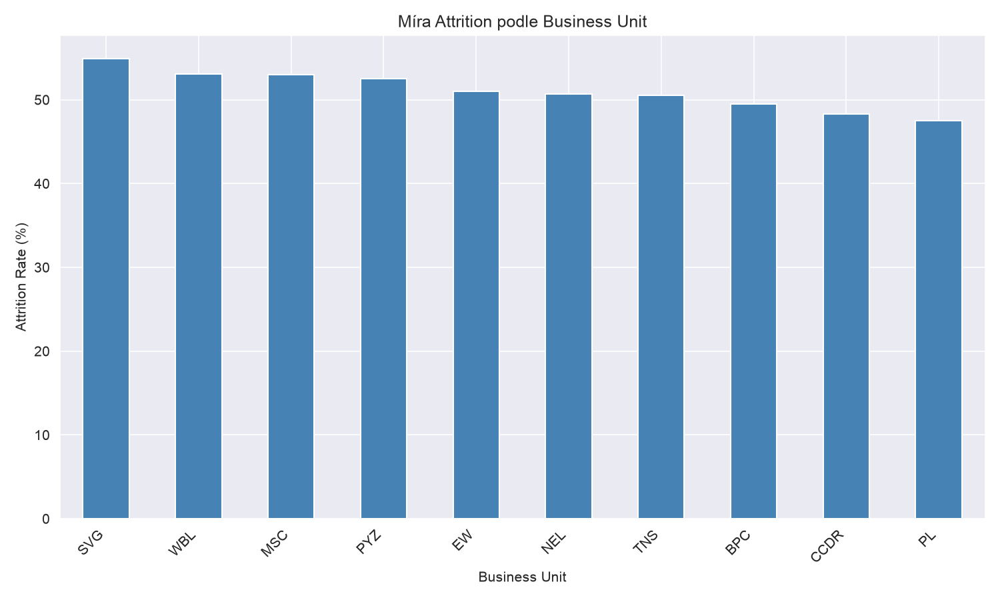
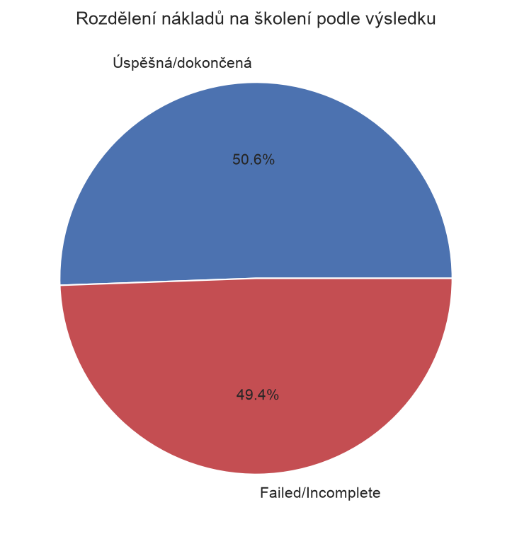

# HR Analytics: Attrition, Training ROI & Pay Equity

## Cíl projektu
Cílem projektu je analyzovat HR data fiktivní/anonymizované firmy a odpovědět na
klíčové otázky, které by v praxi řešilo HR nebo management oddělení: proč
zaměstnanci odcházejí, jestli se firmě vyplácí investice do školení a jestli
existují neopodstatněné rozdíly v odměňování napříč skupinami zaměstnanců.
Projekt demonstruje celý analytický proces – od čištění dat přes SQL a pandas
analýzu až po vizualizace a konkrétní doporučení.

## Otázky, na které odpovídám
1. Jaké faktory nejvíc souvisí s odchodem zaměstnanců (attrition)?
2. Vyplácí se firmě investice do školení – mění se satisfaction/performance po tréninku?
3. Existují rozdíly v zastoupení genderu/rasy napříč platovými zónami a klasifikacemi zaměstnanců?
4. Liší se míra attrition podle konkrétních supervizorů/týmů?

## Data
Zdroj: [HR Analytics Dataset (Kaggle)](https://www.kaggle.com/datasets/hopesb/hr-analytics-dataset)
Dataset obsahuje údaje o zaměstnancích, tréninkových programech, engagement/satisfaction skóre a diverzitních charakteristikách.

**Poznámka k datové governance**: Sloupce s přímou identifikací (jméno, email) byly
z analýzy odstraněny. Sloupec Supervisor byl záměrně ponechán pro analýzu vztahu
mezi vedením týmu a mírou odchodu zaměstnanců.

## Nástroje
- Python (pandas, numpy)
- SQL (SQLite)
- Matplotlib / Seaborn pro vizualizace
- Jupyter Notebook

## Struktura repozitáře
hr-analytics/
├── data/               # surová a vyčištěná data
├── notebooks/          # Jupyter notebooky s analýzou
├── sql/                # SQL dotazy
├── visuals/             # exportované grafy
└── README.md
## Klíčová zjištění

**Attrition (odchody zaměstnanců):** Celková míra odchodu v datasetu je 51,1 %. Žádná
z dostupných proměnných – satisfaction, engagement, work-life balance skóre, hodnocení
výkonu, věk ani business unit – nevykazuje silný vztah k odchodu zaměstnanců. Sloupec
Supervisor navíc neumožňuje smysluplnou týmovou analýzu, protože v průměru spravuje
jen 1 podřízeného.



**Training ROI:** Firma vynaložila na školení celkem $1 675 886, z čehož téměř
polovina ($828 402, tedy 49,4 %) šla na tréninky, které zaměstnanci nedokončili nebo
v nich neuspěli. Přitom nebyl nalezen měřitelný rozdíl v satisfaction, engagement ani
performance skóre mezi zaměstnanci s různým výsledkem školení. Doporučení: před dalším
rozšiřováním tréninkových programů prošetřit příčiny vysoké míry Failed/Incomplete.



**Pay equity:** Dataset neobsahuje přesnou výši mzdy, proto byla rovnost odměňování
zkoumána přes zastoupení v platových zónách (PayZone). Zastoupení podle genderu i rasy
je napříč všemi třemi zónami rovnoměrné (rozdíly do 3 procentních bodů), stejně jako
hodnocení výkonu mezi muži a ženami. Nebyly nalezeny známky systematické nerovnosti
v přiřazování do platových pásem.

**Shrnutí:** Napříč všemi třemi otázkami se ukázal konzistentní vzorec – běžně
sledované HR metriky (satisfaction, engagement, performance) nekorelují se sledovanými
výstupy (attrition, training outcome). To může znamenat, že skutečné hnací faktory
(mzda, kariérní příležitosti, externí nabídky) nejsou v datasetu zachyceny, nebo že jde
o syntetická data bez vestavěných vzorců. Jasně kvantifikovatelný nález přineslo
zkoumání nákladů na školení.

## Jak spustit projekt

1. Naklonuj repozitář:
```bash
   git clone https://github.com/MaxKubic/hr-analytics.git
   cd hr-analytics
```

2. Vytvoř a aktivuj virtuální prostředí:
```bash
   python -m venv .venv
   source .venv/bin/activate  # Windows: .venv\Scripts\activate
```

3. Nainstaluj závislosti:
```bash
   pip install -r requirements.txt
```

4. Spusť notebooky v pořadí (v `notebooks/`):
   - `01_exploration.ipynb` – průzkum a čištění dat
   - `02_attrition_analysis.ipynb` – analýza odchodů zaměstnanců
   - `03_training_roi.ipynb` – analýza návratnosti školení
   - `04_pay_equity_analysis.ipynb` – analýza rovnosti odměňování

   Vyčištěný dataset (`data/processed/HR_Dataset_Clean.csv`) je součástí repozitáře,
   takže notebooky 02–04 lze spustit i bez opětovného spuštění čištění dat.